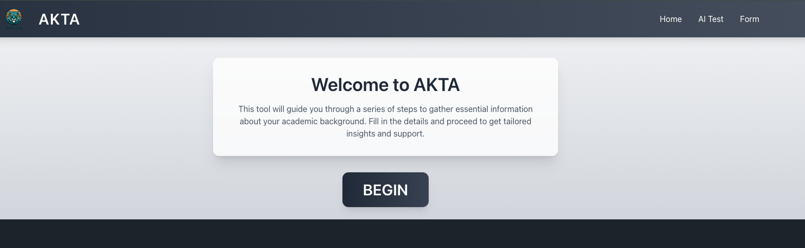
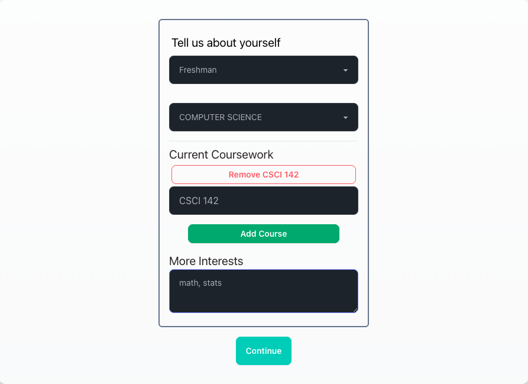

# Akta.life - AI-Powered Personalized Course Hub

## Preview: 

## Check it out

* [Devpost](https://devpost.com/software/akta-life)

## Description

Akta.life is an AI-driven platform designed to personalize course selection for students, especially those who are first-generation or non-traditional. It analyzes learning preferences, academic history, and career goals to provide tailored course and professor recommendations.

**Key Features:**

* **AI-Powered Recommendations:** Personalized course and professor suggestions.
* **Detailed Course Insights:** Information on course expectations, professor styles, and success rates.
* **Accessibility:** Designed to cater to diverse learning backgrounds.

* Built With: React, GPT-3.5-turbo, AI Recommendation Engine, RateMyProfessor Data

## Team

* Glenn Tatum - Front-end Development, UI/UX
* Koushik Sarkar - AI Component, Data Scraping
* Roman Slack - Developer Productivity, React Components
* Wasi Hussain - RateMyProfessor Integration

## Inspiration

Navigating college courses can be overwhelming. Akta.life aims to simplify this process by providing personalized guidance, empowering students to make informed decisions.

## Challenges

* First-time hackathon challenges: task delegation, solidifying value proposition.

## Accomplishments

* Developed an intuitive platform with high user satisfaction in beta testing.
* Created a culturally meaningful brand.

## What We Learned

* Importance of guided support tools for student success.
* The challenges of adjusting to college as freshman.

## Future Plans

* Expand to more institutions.
* Integrate peer mentorship and academic support resources.
* Enhance the recommendation engine with predictive analytics.

## Submitted To

* HACK.COMS '24

